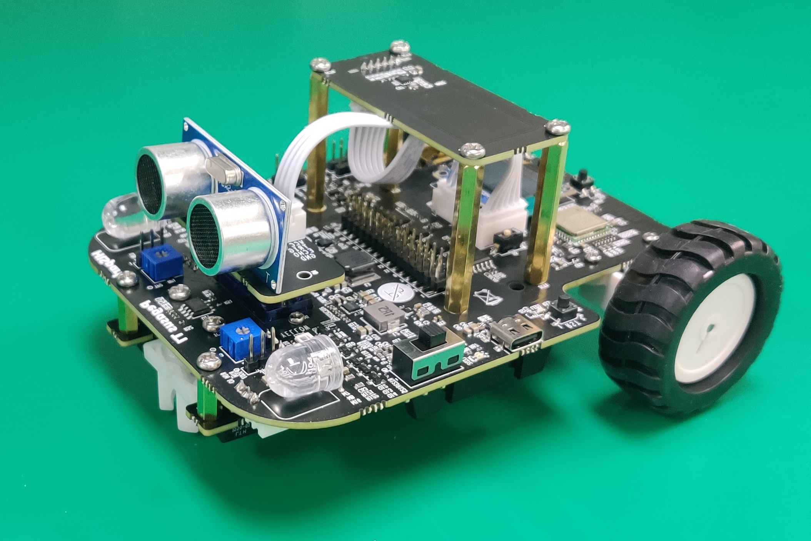
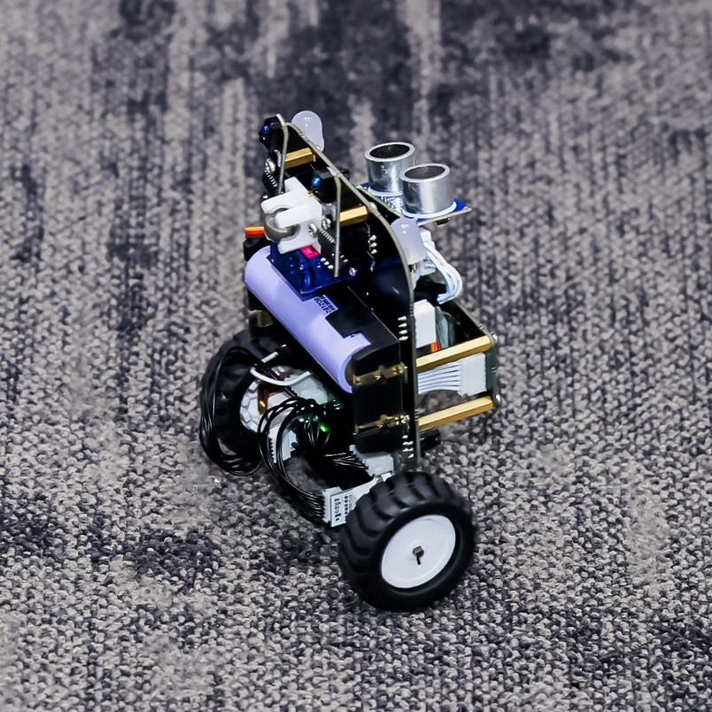
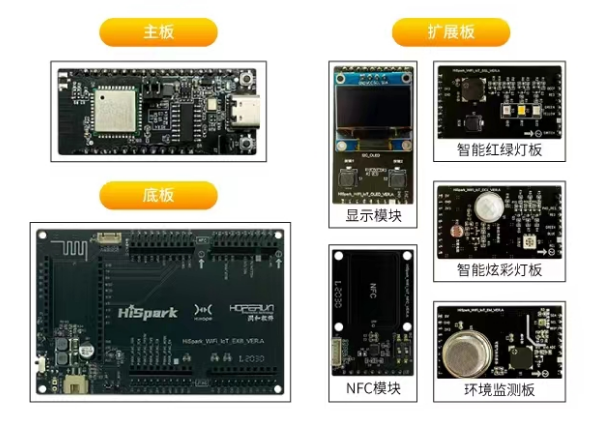
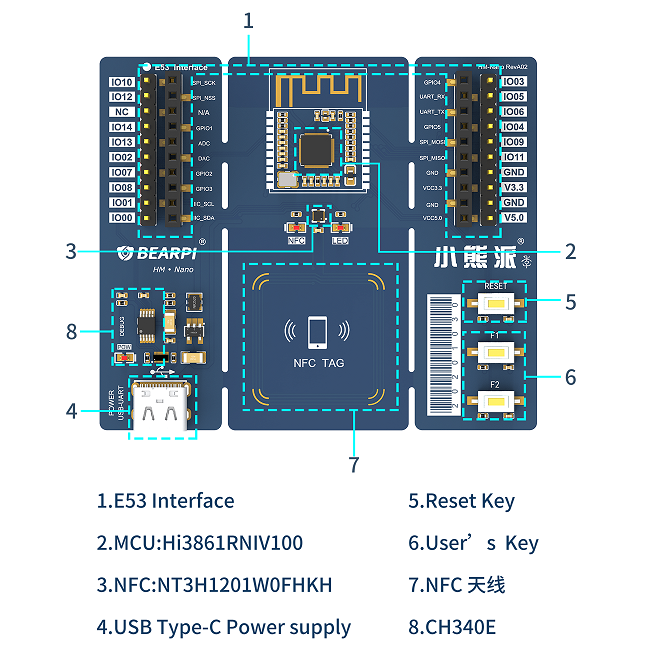

# Hi3861 OpenHarmony 物联网技术及应用

     


# 介绍
这是一个嵌入式软件项目，所以你需要有一块Hi3861V100的开发板。如果你只是想学习Hi3861开发WiFi物联网应用，那么基本上任何一块基于Hi3861V100的开发板板都是可以的（无需编译Vendor目录下demo）。代码仓Vendor目录下支持3种类型的开发板HiSpark T1、Hihope pegesus、BearPI，若您需要增加开发板类型，可以在Vendor目录下创建新的链接。

| 公司   | 开发板         |
| ------ | -------------- |
| 海思   | HiSpark T1     |
| 润和   | Hihope pegesus |
| 小熊派 | BearPI Nano    |


# 开发环境

## windows环境搭建

我们推荐Windows 10 64位系统或以上版本，详细参考doc目录下《物联网技术及应用实验指导手册》手动搭建编译环境。

步骤一：下载devicetool-windows-tool-3.1.0.400.zip版，下载网址：https://device.harmonyos.com/cn/develop/ide#download

步骤二：下载Hi3861 Openharmony SDK下载网址：https://gitee.com/HiSpark/hi3861_hdu_iot_application

步骤三：下载开发工具下载网址：https://hispark.obs.cn-east-3.myhuaweicloud.com/DevTools_Hi3861V100_v1.0.zip

步骤四：打开VSCode，在导入工程弹窗中选择Hi3861 SDK目录，点击“导入”。

步骤五：配置开发工具路径，点击左侧的“工程配置”，在右侧窗口找到“compiler_bin_path”，选择到之前下载的开发工具。

步骤六：配置完成后，点击左侧“build”，开始编译。

步骤七：安装CH340G驱动，打开DevTools_Hi3861V100_v1.0/usb_serial_driver文件夹，安装CH341SER.EXE驱动（硬件需要与电脑连接）。

步骤八：当前DevEco Device Tool工具支持Hi3861单板一键烧录功能。需要连接开发板，配置开发板对应的串口，在编译结束后，进行烧录。点击左侧“工程配置”，找到“upload_port”选项，选择开发板对应的烧录串口

## Linux环境搭建

我们推荐的虚拟机系统配置为VirtualBox 6.0 + Ubuntu20.04, 推荐虚拟机内存2G以上, 虚拟机硬盘20G以上. 你可以通过搜索学习相关的网络文章实现安装虚拟机Linux.

我们推荐使用两块虚拟机网卡, 一块设置成NAT方式, 用于虚拟机连接外部网络, 一块使用Host Only模式, 用于宿主机连接虚拟机, 这样你会遇到最少的问题.

装好虚拟机Linux后, 你可以参考doc目录下的教程手动安装所需的Linux软件, 搭建所有的软件编译环境. 如果你觉得自己从头搭建环境对你来说太复杂, 或者担心新装软件会与原本系统里的一些软件冲突, 又或者你只是想小试一下OpenHarmony的开发体验, 或者你单纯就是懒的话!😶, 我们推荐你使用我们已经封装好的Docker, 因为它是如此的方便! 你只要按照以下的指导一步一步输入命令就可以:

1. 安装docker(如果你的Ubuntu系统没有docker的话)

   ```bash
   sudo apt install docker.io -y
   ```

   或者

   ```bash
   curl -fsSL https://get.docker.com | bash -s docker --mirror Aliyun
   ```

2. 拉取我们封装好的Docker镜像到本地

   ```bash
   docker pull hispark/hi3861_hdu_iot_application:1.0
   ```

3. 新建一个容器命名为openharmony, 映射你的用户目录~到容器内目录/home/hispark, 同时把容器端口22映射为外部端口2222

   ```bash
   docker run -itd -p 2222:22 -v ~/code:/home/hispark --name openharmony hispark/hi3861_hdu_iot_application:1.0
   ```

4. 进入容器

   ```bash
   docker exec -it openharmony /bin/bash
   ```

搞定! 

现在你已经有了一个专门用来编译代码的Docker容器环境了. 你每次可以在虚拟机linux中执行命令行`docker exec -it openharmony /bin/bash`进入这个Docker容器环境, 也可以在Windows中通过ssh软件(推荐MobaXTerm)连接虚拟机的2222端口进入(账户名root, 密码123456)

## 下载代码

假设你按照上一节的方法, 搭建了一个Docker环境, 并已经通过命令行或ssh进入容器内部环境中, 执行

```
cd /home/hispark
```

进入到你映射的用户目录中. **我们建议你把所有代码工作都保存在这个映射目录中, 这是因为Docker的容器环境是临时性的, 当Docker容器销毁时, 内部所有数据信息都会被删除而且无法恢复, 这就是为什么我们强烈建议你把代码工作保存在映射的用户目录中, 因为这里是你真实的用户存储空间, 不会随Docker容器销毁而消失.**

git clone拉取代码

```bash
git clone https://gitee.com/HiSpark_group/hi3861_hdu_iot_application.git
```

## 编译

进入src目录

```bash
cd hi3861_hdu_iot_application/src
```

执行命令`hb set`, 回车两次, 配置OpenHarmony信息

```bash
hb set
```

执行编译

```bash
hb build -f
```

编译完成后的固件镜像在src/out目录中. 编译后的镜像名为Hi3861_loader_signed.bin和Hi3861_wifiiot_app_burn.bin

## 烧录

把编译后的镜像文件copy到Windows中(通过samba或ssh), 然后运行HiBurn([下载](https://ost.51cto.com/resource/29)), 将镜像下载到板上运行. 这里我还是推荐你用命令行的方式运行: 在Windows中建立这样一个脚本, 并命名为例如fast_burn.bat之类的名字, 复制以下内容, 并将大括号{}部分替换为你的实际信息, 修改并保存.

```bat
@ fast_burn.bat
copy
\\{samba路径}\hi3861_hdu_iot_application\src\out\hispark_pegasus\wifiiot_hispark_
pegasus\Hi3861_loader_signed.bin .
copy
\\{samba路径}\hi3861_hdu_iot_application\src\out\hispark_pegasus\wifiiot_hispark_
pegasus\Hi3861_wifiiot_app_burn.bin .
{HiBurn路径} -com:{串口端口号} -bin:Hi3861_wifiiot_app_burn.bin -signalbaud:2000000 -2ms -
loader:Hi3861_loader_signed.bin
```

比如, 我这里的虚拟机网卡IP是192.168.101.56, 我在Win10中通过samba去访问我的代码路径是\\192.168.101.56\share\code, hiburn存放在我电脑的d:\hispark\util目录下, 开发板接入我的电脑, 设备管理器里查看串口号为4, 所以我这里的fast_burn.bat是这样的

```bat
@ fast_burn.bat
copy
\\192.168.101.56\share\code\hi3861_hdu_iot_application\src\out\hispark_pegasus\wifiiot_hispark_
pegasus\Hi3861_loader_signed.bin .
copy
\\192.168.101.56\share\code\hi3861_hdu_iot_application\src\out\hispark_pegasus\wifiiot_hispark_
pegasus\Hi3861_wifiiot_app_burn.bin .
d:\hispark\util\hiburn.exe -com:4 -bin:Hi3861_wifiiot_app_burn.bin -signalbaud:2000000 -2ms -
loader:Hi3861_loader_signed.bin
```

假设上述一切顺利的话, 现在双击这个fast_burn.bat, 将会跳出一个命令行窗口, 并提示你按一下板子的复位按键. 按开发板的复位键后将会自动进入固件烧录过程, 烧录完毕后窗口会自动关闭.

再按一下复位键, 现在, 你的第一个OpenHarmony程序已经在你的开发板上运行起来了. :thumbsup:

# HiSpark T1介绍

##  硬件说明

这是一个嵌入式软件项目, 所以你需要有一块Hi3861V100的开发板. 如果你只是想学习使用Hi3861开发WiFi物联网应用, 那么基本上任何一块基于Hi3861V100的开发板都是可以的. 如果你需要使用这个项目中的全部外设实验用例, 例如陀螺仪, NFC, 马达控制, 平衡车等等, 那么你需要配合一块HiSpark T1开发板使用.

<div align=center>       </div>

## Hispark T1 案例开发

这是一个嵌入式软件项目, 所以你需要有一块Hi3861V100的开发板. 如果你只是想学习使用Hi3861开发WiFi物联网应用, 那么基本上任何一块基于Hi3861V100的开发板都是可以的. 如果你需要使用这个项目中的全部外设实验用例, 例如陀螺仪, NFC, 马达控制, 平衡车等等, 那么你需要配合一块HiSpark T1开发板使用.

* 《物联网技术及应用实验指导手册》：[hispark_T1案例指导文档下载](https://gitee.com/HiSpark/hi3861_hdu_iot_application/blob/master/doc/%E7%89%A9%E8%81%94%E7%BD%91%E6%8A%80%E6%9C%AF%E5%8F%8A%E5%BA%94%E7%94%A8%E5%AE%9E%E9%AA%8C%E6%8C%87%E5%AF%BC%E6%89%8B%E5%86%8C.pdf)

例程列表如下所示：

| 例程名              | 说明                               | 路径                                       |
| ------------------- | ---------------------------------- | ------------------------------------------ |
| led_demo            | 红色LED闪亮                        | 《物联网技术及应用实验指导手册》第3.1章节  |
| encoder_demo        | 编码器                             | 《物联网技术及应用实验指导手册》第3.2章节  |
| tricolor_lamp_demo  | 小车大灯实现红、绿、蓝、白循环闪亮 | 《物联网技术及应用实验指导手册》第3.3章节  |
| button_demo         | IO扩展芯片实现按键功能             | 《物联网技术及应用实验指导手册》第3.4章节  |
| hcsr04_demo         | 超声波                             | 《物联网技术及应用实验指导手册》第3.5章节  |
| motor_demo          | PWM马达转动                        | 《物联网技术及应用实验指导手册》第3.6章节  |
| sg92r_demo          | 舵机90°、0°、-90°                  | 《物联网技术及应用实验指导手册》第3.7章节  |
| cw2015_demo         | 电源管理芯片                       | 《物联网技术及应用实验指导手册》第3.8章节  |
| rtc_demo            | 万年历                             | 《物联网技术及应用实验指导手册》第3.8章节  |
| nfc_demo            | 手机与NFC通信                      | 《物联网技术及应用实验指导手册》第3.9章节  |
| i2c_bus_demo        | I2C总线实验                        | 《物联网技术及应用实验指导手册》第3.10章节 |
| lth1550_demo        | ADC实验模拟信号转为数字信号        | 《物联网技术及应用实验指导手册》第3.11章节 |
| uart_demo           | 串口通信                           | 《物联网技术及应用实验指导手册》第3.12章节 |
| wifi_demo           | WiFi热点创建和WiFi联网             | 《物联网技术及应用实验指导手册》第3.13章节 |
| thread_demo         | 线程                               | 《物联网技术及应用实验指导手册》第4.1章节  |
| semaphore_demo      | 信号量                             | 《物联网技术及应用实验指导手册》第4.2章节  |
| timer_demo          | 定时器                             | 《物联网技术及应用实验指导手册》第4.3章节  |
| interrupt_demo      | 中断实验                           | 《物联网技术及应用实验指导手册》第4.4章节  |
| ultrasonic_car_demo | 超声波避障小车                     | 《物联网技术及应用实验指导手册》第5.1章节  |
| trace_demo          | 循迹小车                           | 《物联网技术及应用实验指导手册》第5.2章节  |
| trace_ex_demo       | IO扩展芯片实现循迹小车             | 《物联网技术及应用实验指导手册》第5.2章节  |
| imu_square_demo     | 基于陀螺仪YAW角控制小车走正方形    | 《物联网技术及应用实验指导手册》第5.3章节  |
| balance_car_demo    | 平衡车                             | 《物联网技术及应用实验指导手册》第5.4章节  |
| histreaming_demo    | 手机控制小车                       | 《物联网技术及应用实验指导手册》第5.5章节  |
| oc_demo             | 基于华为IoT云平台的智能小车实验    | 《物联网技术及应用实验指导手册》第5.6章节  |
|                     |                                    |                                            |

#  Hihope pegesus介绍

## 硬件说明



## Hihope pegesus案例开发

案例地址：https://gitee.com/HiSpark/hi3861_hdu_iot_application/tree/master/src/vendor/hihope/hispark_pegasus/demo

# BearPi-HM Nano介绍

## 硬件说明

小熊派·季[（BearPi-HM Nano）](https://item.taobao.com/item.htm?id=633296694816)是一款由小熊派专为OpenHarmony系统打造的开发板，如下图所示

* 采用IoTCluB的E53接口标准，可接入所有的[E53案例扩展板](https://shop336827451.taobao.com/category-1488778768.htm)。
* 主控为WiFi SoC Hi3861，160MHz主频，SRAM 352KB、ROM 288KB、2M Flash。
* 板载NFC Forum Type 2 Tag芯片及天线，可实现OpenHarmony“碰一碰”功能。
* 一根TypeC USB线，即可实现供电、下载、调试等多种功能。



## BearPi-HM_Nano 案例开发

案例地址：https://gitee.com/HiSpark/hi3861_hdu_iot_application/tree/master/src/vendor/bearpi/bearpi_hm_nano/demo

# 问题与解答

如果你对项目中的代码或者文档存在疑问, 欢迎在Issues中提出你的问题(别忘了先在FAQ中看一看是否已经有答案了😎). 如果你自己解决了一个了不起的问题, 非常欢迎你把问题和解决方法发到Issues里, 如果你看到别人的问题而你正好有答案, 也欢迎你帮助解答其他人的问题, 所谓"授人玫瑰手有余香"嘛.

# 参与贡献
我们非常欢迎你能对这个项目提出代码上的改进或扩展, 方法是:
1.  Fork 本仓库
2.  下载到本地, 修改, 提交
3.  推送代码
4.  在页面点击 Pull Request

这样我们就能接到你的推送申请.

# 最后的话
OpenHarmony还是一个相当年轻的系统, 还在快速的发展中, 所以在这个过程中, 不可避免的你会遇到不少问题, 有些可能还是相当让人下头的那种:confounded:, 不过不要担心, 你可以多尝试几种方法去研究去解决, 也可以用搜索引擎搜索答案, 你当然也可以回到这里提出你的问题, 我们和其他小伙伴会尽力帮助你. 但最重要的是要记得: 所有那些让人仰望的技术大神, 其实都是从这样的阶段磨砺成长起来的. :rainbow:

最后的最后, 欢迎来到OpenHarmony的世界探险!

# 参考

- [HarmonyOS物联网开发课程](https://developer.huawei.com/consumer/cn/training/course/mooc/C101641968823265204?refresh=1669428623989)
