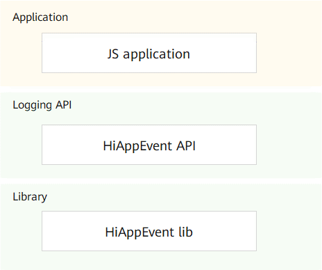

# HiAppEvent<a name="EN-US_TOPIC_0000001162014029"></a>

-   [Introduction](#section11660541593)
-   [Directory Structure](#section161941989596)
-   [Compilation and Building](#section137768191623)
-   [Usage](#section1312121216216)
    -   [Available APIs](#section1551164914237)
    -   [How to Use](#section129654513264)

-   [Repositories Involved](#section1371113476307)

## Introduction<a name="section11660541593"></a>

HiAppEvent is an OpenHarmony module that provides the event logging function for applications to log the fault, statistical, security, and user behavior events reported during running. Based on event information, you will be able to analyze the running status of applications.

<strong>Figure 1</strong> HiAppEvent architecture<a name="fig32154874419"></a>


## Directory Structure<a name="section161941989596"></a>

```
/base/hiviewdfx/hiappevent   # HiAppEvent source code
├── frameworks               # Framework code
│   └── native               # Native implementation code of logging APIs
├── interfaces               # External APIs
│   └── js                   # JS APIs
│       └── innerkits        # JS API implementation code
│           └── napi         # JS APIs implemented based on NAPI
├── test                     # Test cases
```

## Compilation and Building<a name="section137768191623"></a>

Use Clang 8.0.0 and C++11 or higher.

## Usage<a name="section1312121216216"></a>

### Available APIs<a name="section1551164914237"></a>

#### JS APIs

<strong>Table 1</strong> JS APIs for event logging

<a name="table107919166559"></a>
<table><thead align="left"><tr id="row1880201655520"><th class="cellrowborder" valign="top" width="15.981598159815983%" id="mcps1.2.4.1.1"><p id="p5801164558"><a name="p5801164558"></a><a name="p5801164558"></a>Module</p>
</th>
<th class="cellrowborder" valign="top" width="50.68506850685068%" id="mcps1.2.4.1.2"><p id="p168019163559"><a name="p168019163559"></a><a name="p168019163559"></a>API</p>
</th>
<th class="cellrowborder" valign="top" width="33.33333333333333%" id="mcps1.2.4.1.3"><p id="p780101685516"><a name="p780101685516"></a><a name="p780101685516"></a>Description</p>
</th>
</tr>
</thead>
<tbody><tr id="row148011162552"><td class="cellrowborder" valign="top" width="15.981598159815983%" headers="mcps1.2.4.1.1 "><p id="p188061611553"><a name="p188061611553"></a><a name="p188061611553"></a>hiAppEvent</p>
</td>
<td class="cellrowborder" valign="top" width="50.68506850685068%" headers="mcps1.2.4.1.2 "><p id="p1880171695519"><a name="p1880171695519"></a><a name="p1880171695519"></a>write(string eventName, EventType type, object keyValues, AsyncCallback&lt;void&gt; callback): void</p>
</td>
<td class="cellrowborder" valign="top" width="33.33333333333333%" headers="mcps1.2.4.1.3 "><p id="p983410810310"><a name="p983410810310"></a><a name="p983410810310"></a>Logs application events in asynchronous mode. This function uses an asynchronous callback to return the result.</p>
<p id="p683519817319"><a name="p683519817319"></a><a name="p683519817319"></a>Input arguments:</p>
<a name="ul108351681336"></a><a name="ul108351681336"></a><ul id="ul108351681336"><li><strong>eventName</strong>: indicates the event name. </li><li><strong>type</strong>: indicates the event type. </li><li><strong>keyValues</strong>: indicates the key-value pairs of event parameters. The value is in the JSON format. </li><li><strong>callback</strong>: indicates the callback used to process the received return value. The value <strong>0</strong> indicates that the event parameter verification is successful, and the event will be written to the event file asynchronously. A value greater than <strong>0</strong> indicates that invalid parameters are present in the event, and the event will be written to the event file asynchronously after the invalid parameters are ignored. A value smaller than <strong>0</strong> indicates that the event parameter verification fails, and the event will not be written to the event file asynchronously.</li></ul>
</td>
</tr>
<tr id="row78021665512"><td class="cellrowborder" valign="top" width="15.981598159815983%" headers="mcps1.2.4.1.1 "><p id="p1380916165510"><a name="p1380916165510"></a><a name="p1380916165510"></a>hiAppEvent</p>
</td>
<td class="cellrowborder" valign="top" width="50.68506850685068%" headers="mcps1.2.4.1.2 "><p id="p1380161665518"><a name="p1380161665518"></a><a name="p1380161665518"></a>write(string eventName, EventType type, object keyValues): Promise&lt;void&gt;</p>
</td>
<td class="cellrowborder" valign="top" width="33.33333333333333%" headers="mcps1.2.4.1.3 "><p id="p12532811415"><a name="p12532811415"></a><a name="p12532811415"></a>Logs application events in asynchronous mode. This function uses a promise to return the result.</p>
<p id="p75313814417"><a name="p75313814417"></a><a name="p75313814417"></a>Input arguments: same as those in the preceding function</p>
</td>
</tr>
</tbody>
</table>

<strong>Table 2</strong>  JS event types (EventType)

| Type| Description|
| --------- | -------------- |
| FAULT     | Fault event|
| STATISTIC | Statistical event|
| SECURITY  | Security event|
| BEHAVIOR  | Behavior event|

<strong>Table 3</strong>  JS APIs for event logging configuration

<table>
    <tr>
        <td><strong>Module</strong></td>
        <td><strong>API</strong></td>
        <td><strong>Description</strong></td>
    </tr>
    <tr>
        <td>hiAppEvent</td>
        <td>configure(config: ConfigOption): boolean</td>
         <td>Sets the configuration options for application event logging. <br/>Input arguments:<ul><li><strong>config</strong>: indicates configuration options for application event logging. </li></ul>Return value: The value <strong>true</strong> indicates the operation is successful, and the value <strong>false</strong> indicates the opposite.</td>
    </tr>
</table>

<strong>Table 4</strong>  JS logging configuration options (ConfigOption)

| Name| Type| Mandatory| Description|
| ---------- | ------- | ---- | ------------------------------------------------------------ |
| disable    | boolean | No| Application event logging switch. The value <strong>true</strong> means to disable the application event logging function, and the value <strong>false</strong> means the opposite.|
| maxStorage | string  | No| Maximum size of the event file storage directory. The default value is <strong>10M</strong>. If the specified size is exceeded, the oldest event logging files in the directory will be deleted to free up space.|

<strong>Table 5</strong>  JS predefined event name constants (Event)

| Constant| Type| Description|
| ------------------------- | ------ | -------------------- |
| USER_LOGIN                | string | User login event.|
| USER_LOGOUT               | string | User logout event.|
| DISTRIBUTED\_SERVICE\_START| string | Distributed service startup event.|

<strong>Table 6</strong>  JS predefined parameter name constants (Param)

| Constant| Type| Description|
| ------------------------------- | ------ | ------------------ |
| USER_ID                         | string | Custom user ID.|
| DISTRIBUTED\_SERVICE\_NAME| string | Distributed service name.|
| DISTRIBUTED\_SERVICE\_INSTANCE\_ID| string | Distributed service instance ID.|

#### Native APIs

<strong>Table 1</strong>  Native APIs for event logging

<table>
    <tr>
        <td><strong>API</strong></td>
        <td><strong>Return Value</strong></td>
        <td><strong>Description</strong></td>
    </tr>
    <tr>
        <td>OH_HiAppEvent_Write(const char* domain, const char* name, enum EventType type, const ParamList list)</td>
        <td>int</td>
         <td>Implements logging of application events. <br/>Input arguments:
             <ul>
                <li><strong>domain</strong>: indicates the event domain.</li>
                <li><strong>name</strong>: indicates the event name.</li>
                <li><strong>type</strong>: indicates the event type.</li>
                <li><strong>list</strong>: indicates the event parameter list. It is actually a pointer to the the linked list head node — <strong>ParamListNode*</strong>. Each parameter in the list consists of a parameter name and a parameter value.</li>
             </ul>Return value: error code in the int format.
        </td>
    </tr>
</table>

<strong>Table 2</strong>  Native APIs for constructing ParamList

| API| Return Value| Description|
| ------------------------------------------------------------ | --------- | ------------------------------------------------------------ |
| OH\_HiAppEvent\_CreateParamList()| ParamList | Creates a <strong>ParamList</strong> node. A pointer to the created node is returned.|
| OH_HiAppEvent_DestroyParamList(ParamList list)               | void      | Deletes <strong>ParamList</strong> nodes one by one from the head node and releases the memory.|
| OH_HiAppEvent_AddBoolParam(ParamList list, const char* name, bool boolean) | ParamList | Creates a parameter node of the <strong>bool</strong> type and adds it to <strong>ParamList</strong>.|
| OH_HiAppEvent_AddBoolArrayParam(ParamList list, const char* name, const bool* booleans, int arrSize) | ParamList | Creates a parameter node of the <strong>bool</strong> array type and adds it to <strong>ParamList</strong>.|
| OH_HiAppEvent_AddInt8Param(ParamList list, const char* name, int8_t num) | ParamList | Creates a parameter node of the <strong>int8_t</strong> type and adds it to <strong>ParamList</strong>.|
| OH_HiAppEvent_AddInt8ArrayParam(ParamList list, const char* name, const int8_t* nums, int arrSize) | ParamList | Creates a parameter node of the <strong>int8_t</strong> array type and adds it to <strong>ParamList</strong>.|
| OH_HiAppEvent_AddInt16Param(ParamList list, const char* name, int16_t num) | ParamList | Creates a parameter node of the <strong>int16_t</strong> type and adds it to <strong>ParamList</strong>.|
| OH_HiAppEvent_AddInt16ArrayParam(ParamList list, const char* name, const int16_t* nums, int arrSize) | ParamList | Creates a parameter node of the <strong>int16_t</strong> array type and adds it to <strong>ParamList</strong>.|
| OH_HiAppEvent_AddInt32Param(ParamList list, const char* name, int32_t num) | ParamList | Creates a parameter node of the <strong>int32_t</strong> type and adds it to <strong>ParamList</strong>.|
| OH_HiAppEvent_AddInt32ArrayParam(ParamList list, const char* name, const int32_t* nums, int arrSize) | ParamList | Creates a parameter node of the <strong>int32_t</strong> array type and adds it to <strong>ParamList</strong>.|
| OH_HiAppEvent_AddInt64Param(ParamList list, const char* name, int64_t num) | ParamList | Creates a parameter node of the <strong>int64_t</strong> type and adds it to <strong>ParamList</strong>.|
| OH_HiAppEvent_AddInt64ArrayParam(ParamList list, const char* name, const int64_t* nums, int arrSize) | ParamList | Creates a parameter node of the <strong>int64_t</strong> array type and adds the node to <strong>ParamList</strong>.|
| OH_HiAppEvent_AddFloatParam(ParamList list, const char* name, float num) | ParamList | Creates a parameter node of the <strong>float</strong> type and adds it to <strong>ParamList</strong>.|
| OH_HiAppEvent_AddFloatArrayParam(ParamList list, const char* name, const float* nums, int arrSize) | ParamList | Creates a parameter node of the <strong>float</strong> array type and adds it to <strong>ParamList</strong>.|
| OH_HiAppEvent_AddDoubleParam(ParamList list, const char* name, double num) | ParamList | Creates a parameter node of the <strong>double</strong> type and adds it to <strong>ParamList</strong>.|
| OH_HiAppEvent_AddDoubleArrayParam(ParamList list, const char* name, const double* nums, int arrSize) | ParamList | Creates a parameter node of the <strong>double</strong> array type and adds it to <strong>ParamList</strong>.|
| OH_HiAppEvent_AddStringParam(ParamList list, const char* name, const char* str) | ParamList | Creates a parameter node of the <strong>char*</strong> type and adds it to <strong>ParamList</strong>.|
| OH_HiAppEvent_AddStringArrayParam(ParamList list, const char* name, const char * const *strs, int arrSize) | ParamList | Creates a parameter node of the <strong>char*</strong> array type and adds it to <strong>ParamList</strong>.|

<strong>Table 3</strong> Native APIs for event logging configuration 

<table>
    <tr>
        <td><strong>API</strong></td>
        <td><strong>Return Value</strong></td>
        <td><strong>Description</strong></td>
    </tr>
    <tr>
        <td>OH_HiAppEvent_Configure(const char* name, const char* value)</td>
        <td>bool</td>
         <td>Sets the configuration options for application event logging. <br/>Input arguments:
             <ul>
                <li><strong>name</strong>: indicates the name of a configuration item. You can pass a predefined configuration item constant.</li>
                <li><strong>value</strong>: indicates the value of the configuration item.</li>
             </ul>Return value: The value <strong>true</strong> indicates the operation is successful, and the value <strong>false</strong> indicates the opposite.
        </td>
    </tr>
</table>

<strong>Table 4</strong>  Predefined configuration item constants

| Constant| Type| Description|
| ----------- | ------------ | ------------------------------------------------------------ |
| DISABLE     | const char[] | Sets the application event logging switch. The value <strong>true</strong> means to disable the application event logging function, and the value <strong>false</strong> means the opposite.|
| MAX_STORAGE | const char[] | Specifies the maximum size of the event file storage directory. The default value is <strong>10M</strong>.|

<strong>Table 5</strong>  Predefined event name constants

| Constant| Type| Description|
| ------------------------------- | ------------ | ------------------------ |
| EVENT_USER_LOGIN                | const char[] | Name of the user login event.|
| EVENT_USER_LOGOUT               | const char[] | Name of the user logout event.|
| EVENT_DISTRIBUTED_SERVICE_START | const char[] | Name of the distributed service startup event.|

<strong>Table 6</strong>  Predefined parameter name constants

| Constant| Type| Description|
| ------------------------------------- | ------------ | ------------------ |
| PARAM_USER_ID                         | const char[] | Custom user ID.|
| PARAM_DISTRIBUTED_SERVICE_NAME        | const char[] | Distributed service name.|
| PARAM_DISTRIBUTED_SERVICE_INSTANCE_ID | const char[] | Distributed service instance ID.|

### How to Use<a name="section129654513264"></a>

#### JS

1.  Develop the source code.

    Import the HiAppEvent module.

    ```js
    import hiAppEvent from '@ohos.hiAppEvent'
    ```

2.  Log application events.

    ```js
    // Callback mode
    hiAppEvent.write("test_event", hiAppEvent.EventType.FAULT, {"int_data":100, "str_data":"strValue"}, (err, value) => {
        if (err) {
            // Event writing failed: The event contains invalid parameters or the event parameter verification fails.
            console.error(`failed to write event because ${err.code}`);
            return;
        }

        // Event writing succeeded.
        console.log(`success to write event: ${value}`);
    });

    // Promise mode
    hiAppEvent.write("test_event", hiAppEvent.EventType.FAULT, {"int_data":100, "str_data":"strValue"})
        .then((value) => {
            // Event writing succeeded.
            console.log(`success to write event: ${value}`);
        }).catch((err) => {
            // Event writing failed: The event contains invalid parameters or the event parameter verification fails.
            console.error(`failed to write event because ${err.code}`);
        });
    ```

3. Customize the application event logging function.

    ```js
    // Set the application event logging switch.
    hiAppEvent.configure({
        disable: true
    })

    // Set the maximum size of the directory that stores the event logging files.
    hiAppEvent.configure({
        maxStorage: '100M'
    })
    ```

#### Native

1. Develop the source code.

   Import the HiAppEvent module.

   ```c++
   #include "hiappevent/hiappevent.h"
   ```

2. Log application events.

   ```c++
   // 1. Create an empty <strong>ParamList</strong> object.
   ParamList list = OH_HiAppEvent_CreateParamList();

   // 2. Adds key-value pair parameters to the <strong>ParamList</strong> object.
   // 2.1 Pass a value in the int32_t format.
   int32_t num = 1;
   OH_HiAppEvent_AddInt32Param(list, "int32_key", num);
   // 2.2 Pass a value in the int32_t array format.
   int32_t nums3[] = {1, INT32_MAX, INT32_MIN};
   OH_HiAppEvent_AddInt32ArrayParam(list, "int32_arr_key", nums3, sizeof(nums3) / sizeof(nums3[0]));
   // 2.3 Pass a parameter value in the string array format.
   char str1[] = "hello";
   char str2[] = "world";
   char* strs[] = {str1, str2};
   OH_HiAppEvent_AddStringArrayParam(list, "string_arr_key", strs, sizeof(strs) / sizeof(strs[0]));

   // 3. Log application events.
   int result = OH_HiAppEvent_Write("domain", "name", BEHAVIOR, list);
   printf("HiAppEvent logging test, res=%d\n", result);

   // 4. Destroy the <strong>ParamLIst</strong> object to release the memory.
   OH_HiAppEvent_DestroyParamList(list);
   ```

3. Customize the application event logging function.

   ```c++
   // Disable the application event logging function.
   OH_HiAppEvent_Configure(DISABLE, "true");

   // Set the maximum size of the directory that stores the event logging files to 100M.
   OH_HiAppEvent_Configure(MAX_STORAGE, "100M");
   ```

## Repositories Involved<a name="section1371113476307"></a>

[DFX Subsystem](https://gitee.com/openharmony/docs/blob/master/en/readme/DFX%E5%AD%90%E7%B3%BB%E7%BB%9F.md)

[hiviewdfx\_hiview](https://gitee.com/openharmony/hiviewdfx_hiview/blob/master/README.md)

[hiviewdfx\_hilog](https://gitee.com/openharmony/hiviewdfx_hilog/blob/master/README.md)

<strong>hiviewdfx\_hiappevent</strong>

[hiviewdfx\_hisysevent](https://gitee.com/openharmony/hiviewdfx_hisysevent/blob/master/README.md)

[hiviewdfx\_faultloggerd](https://gitee.com/openharmony/hiviewdfx_faultloggerd/blob/master/README.md)

[hiviewdfx\_hilog\_lite](https://gitee.com/openharmony/hiviewdfx_hilog_lite/blob/master/README.md)

[hiviewdfx\_hievent\_lite](https://gitee.com/openharmony/hiviewdfx_hievent_lite/blob/master/README.md)

[hiviewdfx\_hiview\_lite](https://gitee.com/openharmony/hiviewdfx_hiview_lite/blob/master/README.md)
