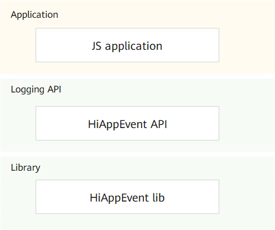

# HiAppEvent组件<a name="ZH-CN_TOPIC_0000001162014029"></a>

-   [简介](#section11660541593)
-   [目录](#section161941989596)
-   [编译构建](#section137768191623)
-   [说明](#section1312121216216)
    -   [接口说明](#section1551164914237)
    -   [使用说明](#section129654513264)

-   [相关仓](#section1371113476307)

## 简介<a name="section11660541593"></a>

HiAppEvent为OpenHarmony应用提供事件打点接口，用于帮助应用记录在运行过程中发生的故障信息、统计信息、安全信息、用户行为信息，以支撑开发者分析应用的运行情况。

**图 1**  HiAppEvent架构图<a name="fig32154874419"></a>  


## 目录<a name="section161941989596"></a>

```
/base/hiviewdfx/hiappevent   # hiappevent部件代码
├── frameworks               # 框架代码
│   └── native               # 打点接口的native实现代码
├── interfaces               # 对外接口存放目录
│   └── js                   # js接口
│       └── innerkits        # js接口内部实现代码
│           └── napi         # 基于napi实现的js接口代码
├── test                     # 测试用例代码
```

## 编译构建<a name="section137768191623"></a>

依赖 Clang 编译器\(Clang 8.0.0 \)及以上，依赖C++11版本及以上。

## 说明<a name="section1312121216216"></a>

### 接口说明<a name="section1551164914237"></a>

#### JS接口说明

**表 1**  JS 打点接口介绍

<a name="table107919166559"></a>
<table><thead align="left"><tr id="row1880201655520"><th class="cellrowborder" valign="top" width="15.981598159815983%" id="mcps1.2.4.1.1"><p id="p5801164558"><a name="p5801164558"></a><a name="p5801164558"></a>模块</p>
</th>
<th class="cellrowborder" valign="top" width="50.68506850685068%" id="mcps1.2.4.1.2"><p id="p168019163559"><a name="p168019163559"></a><a name="p168019163559"></a>方法</p>
</th>
<th class="cellrowborder" valign="top" width="33.33333333333333%" id="mcps1.2.4.1.3"><p id="p780101685516"><a name="p780101685516"></a><a name="p780101685516"></a>描述</p>
</th>
</tr>
</thead>
<tbody><tr id="row148011162552"><td class="cellrowborder" valign="top" width="15.981598159815983%" headers="mcps1.2.4.1.1 "><p id="p188061611553"><a name="p188061611553"></a><a name="p188061611553"></a>hiAppEvent</p>
</td>
<td class="cellrowborder" valign="top" width="50.68506850685068%" headers="mcps1.2.4.1.2 "><p id="p1880171695519"><a name="p1880171695519"></a><a name="p1880171695519"></a>write(string eventName, EventType type, object keyValues, AsyncCallback&lt;void&gt; callback): void</p>
</td>
<td class="cellrowborder" valign="top" width="33.33333333333333%" headers="mcps1.2.4.1.3 "><p id="p983410810310"><a name="p983410810310"></a><a name="p983410810310"></a>接口功能：应用事件异步打点方法，使用callback方式作为异步回调。</p>
<p id="p683519817319"><a name="p683519817319"></a><a name="p683519817319"></a>输入参数：</p>
<a name="ul108351681336"></a><a name="ul108351681336"></a><ul id="ul108351681336"><li>eventName：事件名称。</li><li>type：事件类型。</li><li>keyValues：事件参数键值对，为Json对象类型。</li><li>callback：回调函数，可以在回调函数中处理接口返回值。返回值为0表示事件参数校验成功，事件正常异步写入事件文件；大于0表示事件存在异常参数，事件在忽略异常参数后再异步写入事件文件；小于0表示事件校验失败，不执行事件异步打点操作。</li></ul>
</td>
</tr>
<tr id="row78021665512"><td class="cellrowborder" valign="top" width="15.981598159815983%" headers="mcps1.2.4.1.1 "><p id="p1380916165510"><a name="p1380916165510"></a><a name="p1380916165510"></a>hiAppEvent</p>
</td>
<td class="cellrowborder" valign="top" width="50.68506850685068%" headers="mcps1.2.4.1.2 "><p id="p1380161665518"><a name="p1380161665518"></a><a name="p1380161665518"></a>write(string eventName, EventType type, object keyValues): Promise&lt;void&gt;</p>
</td>
<td class="cellrowborder" valign="top" width="33.33333333333333%" headers="mcps1.2.4.1.3 "><p id="p12532811415"><a name="p12532811415"></a><a name="p12532811415"></a>接口功能：应用事件异步打点方法，使用promise方式作为异步回调。</p>
<p id="p75313814417"><a name="p75313814417"></a><a name="p75313814417"></a>输入参数：同上。</p>
</td>
</tr>
</tbody>
</table>

**表 2**  JS 事件类型枚举——EventType

| 类型      | 描述           |
| --------- | -------------- |
| FAULT     | 故障类型事件。 |
| STATISTIC | 统计类型事件。 |
| SECURITY  | 安全类型事件。 |
| BEHAVIOR  | 行为类型事件。 |

**表 3**  JS 打点配置接口介绍

<table>
    <tr>
        <td>模块</td>
        <td>方法</td>
        <td>描述</td>
    </tr>
    <tr>
        <td>hiAppEvent</td>
        <td>configure(config: ConfigOption): boolean</td>
         <td>接口功能：应用事件打点配置方法，可以对打点功能进行自定义配置。<br/>输入参数：<ul><li>config：应用事件打点配置项对象。</li></ul>返回值：boolean，true表示配置成功，false表示配置失败。</td>
    </tr>
</table>

**表 4**  JS 应用打点配置选项——ConfigOption

| 参数名     | 类型    | 必填 | 说明                                                         |
| ---------- | ------- | ---- | ------------------------------------------------------------ |
| disable    | boolean | 否   | 应用打点功能开关。配置值为true表示关闭打点功能，false表示不关闭打点功能。 |
| maxStorage | string  | 否   | 打点数据本地存储文件所在目录的配额大小，默认限额为“10M”。所在目录大小超出限额后会对目录进行清理操作，会按从旧到新的顺序逐个删除打点数据文件，直到目录大小不超出限额时停止。 |

**表 5** JS 预定义事件名称常量接口——Event

| 常量名                    | 类型   | 描述                 |
| ------------------------- | ------ | -------------------- |
| USER_LOGIN                | string | 用户登录事件。       |
| USER_LOGOUT               | string | 用户登出事件。       |
| DISTRIBUTED_SERVICE_START | string | 分布式服务启动事件。 |

**表 6**  JS 预定义参数名称常量接口——Param

| 常量名                          | 类型   | 描述               |
| ------------------------------- | ------ | ------------------ |
| USER_ID                         | string | 用户自定义ID。     |
| DISTRIBUTED_SERVICE_NAME        | string | 分布式服务名称。   |
| DISTRIBUTED_SERVICE_INSTANCE_ID | string | 分布式服务实例ID。 |

#### Native接口说明

**表 1**  打点接口介绍

<table>
    <tr>
        <td>方法</td>
        <td>返回值</td>
        <td>描述</td>
    </tr>
    <tr>
        <td>OH_HiAppEvent_Write(const char* domain, const char* name, enum EventType type, const ParamList list)</td>
        <td>int</td>
         <td>接口功能：应用事件打点方法。<br/>输入参数：
             <ul>
                <li>domain：事件领域。</li>
                <li>name：事件名称。</li>
                <li>type：事件类型。</li>
                <li>list：事件参数列表，实质上是一个指向链表头节点的指针——ParamListNode*，列表的每个参数节点由参数名和参数值组成。</li>
             </ul>返回值：int，错误码。
        </td>
    </tr>
</table>

**表 2**  事件参数列表构造接口介绍

| 方法                                                         | 返回值    | 描述                                                         |
| ------------------------------------------------------------ | --------- | ------------------------------------------------------------ |
| OH_HiAppEvent_CreateParamList()                              | ParamList | 创建一个ParamList节点。返回指向创建节点的指针。              |
| OH_HiAppEvent_DestroyParamList(ParamList list)               | void      | 从头节点开始逐个删除参数列表的各个节点，并释放内存。         |
| OH_HiAppEvent_AddBoolParam(ParamList list, const char* name, bool boolean) | ParamList | 创建一个bool类型的参数节点，并将该节点添加到ParamList。      |
| OH_HiAppEvent_AddBoolArrayParam(ParamList list, const char* name, const bool* booleans, int arrSize) | ParamList | 创建一个bool数组类型的参数节点，并将该节点添加到ParamList。  |
| OH_HiAppEvent_AddInt8Param(ParamList list, const char* name, int8_t num) | ParamList | 创建一个int8_t类型的参数节点，并将该节点添加到ParamList。    |
| OH_HiAppEvent_AddInt8ArrayParam(ParamList list, const char* name, const int8_t* nums, int arrSize) | ParamList | 创建一个int8_t数组类型的参数节点，并将该节点添加到ParamList。 |
| OH_HiAppEvent_AddInt16Param(ParamList list, const char* name, int16_t num) | ParamList | 创建一个int16_t类型的参数节点，并将该节点添加到ParamList。   |
| OH_HiAppEvent_AddInt16ArrayParam(ParamList list, const char* name, const int16_t* nums, int arrSize) | ParamList | 创建一个int16_t数组类型的参数节点，并将该节点添加到ParamList。 |
| OH_HiAppEvent_AddInt32Param(ParamList list, const char* name, int32_t num) | ParamList | 创建一个int32_t类型的参数节点，并将该节点添加到ParamList。   |
| OH_HiAppEvent_AddInt32ArrayParam(ParamList list, const char* name, const int32_t* nums, int arrSize) | ParamList | 创建一个int32_t数组类型的参数节点，并将该节点添加到ParamList。 |
| OH_HiAppEvent_AddInt64Param(ParamList list, const char* name, int64_t num) | ParamList | 创建一个int64_t类型的参数节点，并将该节点添加到ParamList。   |
| OH_HiAppEvent_AddInt64ArrayParam(ParamList list, const char* name, const int64_t* nums, int arrSize) | ParamList | 创建一个int64_t数组类型的参数节点，并将该节点添加到ParamList。 |
| OH_HiAppEvent_AddFloatParam(ParamList list, const char* name, float num) | ParamList | 创建一个float类型的参数节点，并将该节点添加到ParamList。     |
| OH_HiAppEvent_AddFloatArrayParam(ParamList list, const char* name, const float* nums, int arrSize) | ParamList | 创建一个float数组类型的参数节点，并将该节点添加到ParamList。 |
| OH_HiAppEvent_AddDoubleParam(ParamList list, const char* name, double num) | ParamList | 创建一个double类型的参数节点，并将该节点添加到ParamList。    |
| OH_HiAppEvent_AddDoubleArrayParam(ParamList list, const char* name, const double* nums, int arrSize) | ParamList | 创建一个double数组类型的参数节点，并将该节点添加到ParamList。 |
| OH_HiAppEvent_AddStringParam(ParamList list, const char* name, const char* str) | ParamList | 创建一个char*类型的参数节点，并将该节点添加到ParamList。     |
| OH_HiAppEvent_AddStringArrayParam(ParamList list, const char* name, const char * const *strs, int arrSize) | ParamList | 创建一个char*数组类型的参数节点，并将该节点添加到ParamList。 |

**表 3**  打点配置接口介绍

<table>
    <tr>
        <td>方法</td>
        <td>返回值</td>
        <td>描述</td>
    </tr>
    <tr>
        <td>OH_HiAppEvent_Configure(const char* name, const char* value)</td>
        <td>bool</td>
         <td>接口功能：应用事件打点配置方法，可以对打点功能进行自定义配置。<br/>输入参数：
             <ul>
                <li>name：配置项名称，可直接传入预定义好的配置项常量。</li>
                <li>value：配置项值。</li>
             </ul>返回值：bool，返回true表示配置成功，返回false表示配置失败。
        </td>
    </tr>
</table>

**表 4**  配置项常量介绍

| 常量名      | 类型         | 描述                                                         |
| ----------- | ------------ | ------------------------------------------------------------ |
| DISABLE     | const char[] | 打点功能开关的配置项名称，对应的默认配置值为“false”表示不关闭打点功能。 |
| MAX_STORAGE | const char[] | 打点落盘文件存放目录配额大小的配置项名称，对应的默认配置值为“10M”。 |

**表 5**  预定义事件名称常量介绍

| 常量名                          | 类型         | 描述                     |
| ------------------------------- | ------------ | ------------------------ |
| EVENT_USER_LOGIN                | const char[] | 用户登录事件名称。       |
| EVENT_USER_LOGOUT               | const char[] | 用户登出事件名称。       |
| EVENT_DISTRIBUTED_SERVICE_START | const char[] | 分布式服务启动事件名称。 |

**表 6**  预定义参数名称常量介绍

| 类型                                  | 描述         |                    |
| ------------------------------------- | ------------ | ------------------ |
| PARAM_USER_ID                         | const char[] | 用户自定义ID。     |
| PARAM_DISTRIBUTED_SERVICE_NAME        | const char[] | 分布式服务名称。   |
| PARAM_DISTRIBUTED_SERVICE_INSTANCE_ID | const char[] | 分布式服务实例ID。 |

### 使用说明<a name="section129654513264"></a>

#### JS接口开发实例

1.  源代码开发

    引入模块：

    ```js
    import hiAppEvent from '@ohos.hiAppEvent'
    ```

2.  应用执行事件打点

    ```js
    // callback方式
    hiAppEvent.write("test_event", hiAppEvent.EventType.FAULT, {"int_data":100, "str_data":"strValue"}, (err, value) => {
        if (err) {
            // 事件写入异常：事件存在异常参数或者事件校验失败不执行写入
            console.error(`failed to write event because ${err.code}`);
            return;
        }

        // 事件写入正常
        console.log(`success to write event: ${value}`);
    });

    // Promise方式
    hiAppEvent.write("test_event", hiAppEvent.EventType.FAULT, {"int_data":100, "str_data":"strValue"})
        .then((value) => {
            // 事件写入正常
            console.log(`success to write event: ${value}`);
        }).catch((err) => {
            // 事件写入异常：事件存在异常参数或者事件校验失败不执行写入
            console.error(`failed to write event because ${err.code}`);
        });
    ```

3. 应用对打点功能进行自定义配置

    ```js
    // 配置应用事件打点功能开关
    hiAppEvent.configure({
        disable: true
    })

    // 配置事件文件目录存储限额大小
    hiAppEvent.configure({
        maxStorage: '100M'
    })
    ```

#### Native接口开发实例

1. 源代码开发

   引入模块：

   ```c++
   #include "hiappevent/hiappevent.h"
   ```

2. 应用执行事件打点

   ```c++
   // 1. 创建空参数list
   ParamList list = OH_HiAppEvent_CreateParamList();

   // 2. 向list添加要传入的键值对参数
   // 2.1 传入int32_t参数值
   int32_t num = 1;
   OH_HiAppEvent_AddInt32Param(list, "int32_key", num);
   // 2.2 传入int32_t数组参数值
   int32_t nums3[] = {1, INT32_MAX, INT32_MIN};
   OH_HiAppEvent_AddInt32ArrayParam(list, "int32_arr_key", nums3, sizeof(nums3) / sizeof(nums3[0]));
   // 2.3 传入字符串数组参数值
   char str1[] = "hello";
   char str2[] = "world";
   char* strs[] = {str1, str2};
   OH_HiAppEvent_AddStringArrayParam(list, "string_arr_key", strs, sizeof(strs) / sizeof(strs[0]));

   // 3. 执行打点操作
   int result = OH_HiAppEvent_Write("domain", "name", BEHAVIOR, list);
   printf("HiAppEvent logging test, res=%d\n", result);

   // 4. 销毁ParamLIst对象，释放内存
   OH_HiAppEvent_DestroyParamList(list);
   ```

3. 应用对打点功能进行自定义配置

   ```c++
   // 关闭应用打点功能
   OH_HiAppEvent_Configure(DISABLE, "true");

   // 配置打点数据文件目录存储限额为100M
   OH_HiAppEvent_Configure(MAX_STORAGE, "100M");
   ```

## 相关仓<a name="section1371113476307"></a>

[DFX子系统](https://gitee.com/openharmony/docs/blob/master/zh-cn/readme/DFX%E5%AD%90%E7%B3%BB%E7%BB%9F.md)

[hiviewdfx\_hiview](https://gitee.com/openharmony/hiviewdfx_hiview/blob/master/README_zh.md)

[hiviewdfx\_hilog](https://gitee.com/openharmony/hiviewdfx_hilog/blob/master/README_zh.md)

**hiviewdfx\_hiappevent**

[hiviewdfx\_hisysevent](https://gitee.com/openharmony/hiviewdfx_hisysevent/blob/master/README_zh.md)

[hiviewdfx\_faultloggerd](https://gitee.com/openharmony/hiviewdfx_faultloggerd/blob/master/README_zh.md)

[hiviewdfx\_hilog\_lite](https://gitee.com/openharmony/hiviewdfx_hilog_lite/blob/master/README_zh.md)

[hiviewdfx\_hievent\_lite](https://gitee.com/openharmony/hiviewdfx_hievent_lite/blob/master/README_zh.md)

[hiviewdfx\_hiview\_lite](https://gitee.com/openharmony/hiviewdfx_hiview_lite/blob/master/README_zh.md)

