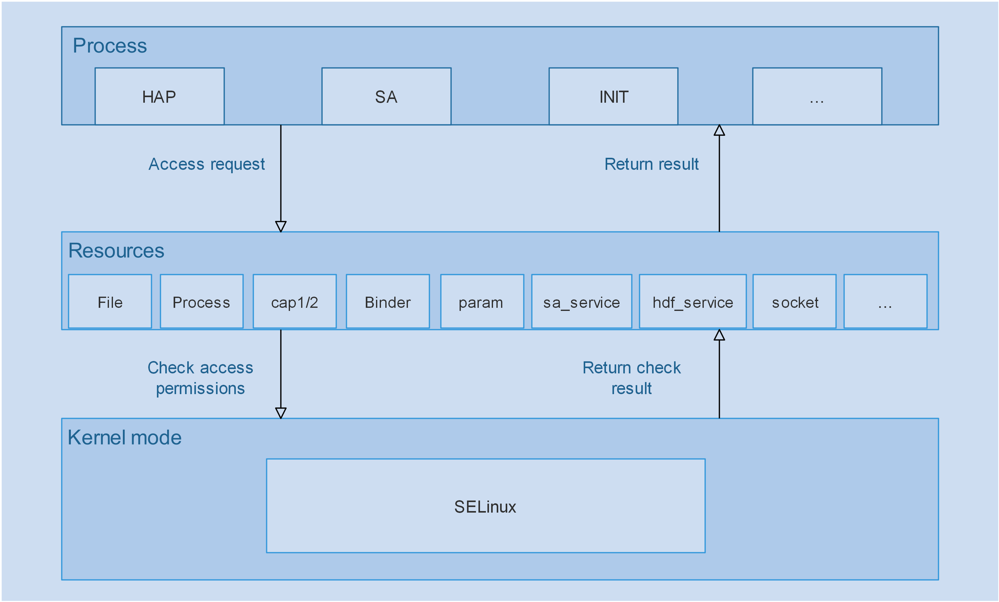

# security_selinux

## Introduction

Security-Enhanced Linux (SELinux) is an outstanding security subsystem in the history of Linux. The SELinux SIG is set up to introduce SELinux to OpenHarmony.

> - SELinux is a set of kernel modifications and user-space tools with access control security policies, including mandatory access control (MAC).
> - SELinux has been added to various Linux distributions. The software architecture of SELinux attempts to separate enforcement of security decisions from the security policy and streamlines the amount of software involved with security policy enforcement.

## Repositories

The table below lists the repositories involved.

| Repository| Source Code| Description|
| --- | --- | --- |
| [security_selinux](https://gitee.com/openharmony/security_selinux.git) | `base/security/selinux/` | Provides policies and self-developed APIs.|
| [third_party_selinux](https://gitee.com/openharmony/third_party_selinux.git) | `third_party/selinux/` | SELinux main repository.|
| [productdefine_common](https://gitee.com/openharmony/productdefine_common.git) | `productdefine/common/` | Provides SELinux component definitions.|
| [third_party_toybox](https://gitee.com/openharmony/third_party_toybox.git) | `third_party/toybox/` | Provides the support for SELinux of `ls`.|
| [startup_init_lite](https://gitee.com/openharmony/startup_init_lite.git) | `base/startup/init_lite/` | Provides the init_lite module, which starts the first application.|
| [third_party_FreeBSD](https://gitee.com/openharmony/third_party_FreeBSD.git) | `third_party/FreeBSD/` | Provides the fts library.|
| [third_party_pcre](https://gitee.com/openharmony/third_party_pcre2.git) | `third_party/pcre/` | Provides the pcre2 library.|
| [build](https://gitee.com/openharmony/build.git) | `build/` | Provides the code for build.|

## Architecture

### Overall Architecture



The following SELinux components are used in [third_party_selinux](https://gitee.com/openharmony/third_party_selinux.git):

| Component| Source| Description| Format|
| --- | --- | --- | --- |
| `checkpolicy/` | [selinux/checkpolicy](https://github.com/SELinuxProject/selinux/tree/cf853c1a0c2328ad6c62fb2b2cc55d4926301d6b/checkpolicy) | `checkpolicy` | Executable file|
| `libselinux/` | [selinux/libselinux](https://github.com/SELinuxProject/selinux/tree/cf853c1a0c2328ad6c62fb2b2cc55d4926301d6b/libselinux) | `libselinux.so`, `getenforce`, `setenforce`| Dynamic library|
| `libsepol/` | [selinux/libsepol](https://github.com/SELinuxProject/selinux/tree/cf853c1a0c2328ad6c62fb2b2cc55d4926301d6b/libsepol) | Provides internal APIs.| Dynamic library|
| `seclic/` | [selinux/seclic](https://github.com/SELinuxProject/selinux/tree/cf853c1a0c2328ad6c62fb2b2cc55d4926301d6b/secilc) | `seclic` | Executable file|


### Directory Structure

```
.
├── config                  # Third-party library configuration file of the board.
├── docs                    # Documents.
│   └── images
├── interfaces
│   ├── policycoreutils     # libload_policy.so and librestorecon.so of the board.
│   │   ├── include
│   │   └── src
│   └── tools               # load_policy and restorecon of the board.
│       ├── load_policy
│       └── restorecon
├── scripts                 # Security policy compilation scripts.
├── sepolicy                # Security policy files.
└── test                    # Test program.
```

## Verification

### Compiling Source Code

1. Obtain the source code. For details, see [Obtaining Source Code](https://gitee.com/openharmony/docs/blob/master/en/device-dev/quick-start/quickstart-standard-sourcecode-acquire.md).
1. Compile the source code. For details, see [Building](https://gitee.com/openharmony/docs/blob/master/en/device-dev/quick-start/quickstart-standard-running-hi3516-build.md).

### Building the Image

Currently, SELinux supports only the RK3568 device. Run the following command to build the image that supports SELinux:

```
Independent build command of this module:
./build.sh --product-name=rk3568 -T selinux --ccache
```
### Verifying Basic Functions

Burn the image to the development board, start the board, run **shell** through the serial port, and run the following commands:

```
ls -lZ /          # View the file label. 
ls -lLZ /         # View the link source file label.
ps -eZ            # View the process label.
setenforce 1      # Enable the enforcing mode.
setenforce 0      # Enable the permissive mode, which is the default mode.
getenforce        # Obtain the SELinux working mode.
```
Policy file: **/etc/selinux/targeted/policy/policy.31**

File labeling rule: **/etc/selinux/targeted/policy/file_contexts**

SELinux mode switch: **/etc/selinux/config**

During the verification, you can replace the preceding files separately.

### Log

```
audit: type=1400 audit(1502458430.566:4): avc:  denied  { open } for  pid=1658 comm="setenforce" path="/sys/fs/selinux/enforce" dev="selinuxfs" ino=4 scontext=u:r:hdcd:s0 tcontext=u:object_r:selinuxfs:s0 tclass=file permissive=1

The log information is interpreted as follows:
open                                # The operation is open.
pid=1658                            # The process ID is 1658.
comm="setenforce"                   # The process name is setenforce.
path="/sys/fs/selinux/enforce"      # The path accessed by the process is /sys/fs/selinux/enforce.
dev="selinuxfs"                     # The file accessed belongs to the SELinux filesystem (selinuxfs).
ino=4                               # The file node No. is 4.
scontext=u:r:hdcd:s0                # The SELinux label of the process is u:r:hdcd:s0.
tcontext=u:object_r:selinuxfs:s0    # The SELinux label of the accessed file is u:object_r:selinuxfs:s0.
tclass=file                         # The current alarm is about a file operation.
permissive=1                        # The SELinux is running in permissive mode, that is, the system does not deny any operation but only logs Access Vector Cache (AVC) message for troubleshooting or debugging. If permissive is set to 0, the SELinux is running in enforcing mode and denies access based on SeLunix policy rules.  
```

### Writing a Policy Rule

```
Obtain the access information based on the AVC message.
Example:
audit: type=1400 audit(1502458430.566:4): avc:  denied  { open } for  pid=1658 comm="setenforce" path="/sys/fs/selinux/enforce" dev="selinuxfs" ino=4 scontext=u:r:hdcd:s0 tcontext=u:object_r:selinuxfs:s0 tclass=file permissive=1
The rule is as follows:
allow hdcd selinuxfs:file open;
```
